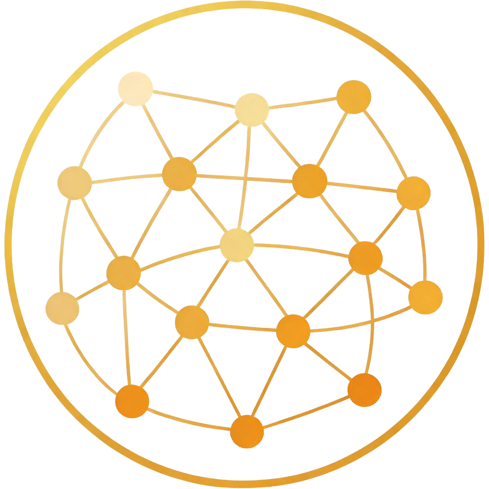

<p align="center">
  
</p>

<h1 align="center">spatialrc</h1>

<p align="center">
  <strong>Spatially-embedded, delay-aware connectome reservoir computing — with pluggable compute backends.</strong>
</p>

<p align="center">
  
  
  
  
  
  
  
  
</p>

A base-agnostic add-on for connectome reservoir computing (drop it into a private
fork of [conn2res](https://github.com/netneurolab/conn2res) *or*
[reservoirpy](https://github.com/reservoirpy/reservoirpy), or use it standalone).
It implements the three spatial-embedding capabilities flagged in the conn2res
paper's Discussion, adds a selectable compute backend for the expensive kernels,
and ships a visualization module matched to the library's outputs.

## What it does

1. **Spatial constraints / EDR reweighting** — `geometry.Geometry`: node
   coordinates, geodesic / Euclidean / streamline-length distance matrices, EDR
   fitting (`fit_edr_lambda`) and reweighting (`edr_reweight`).
2. **Conduction delays** proportional to distance — `DelayedEchoStateNetwork`
   (conn2res-compatible `simulate`) and `TorchDelayReservoir` (sparse, GPU,
   optional learnable distance kernel). A per-edge ring-buffer gather replaces
   the instantaneous lag-1 recurrence; `delay == 1` everywhere reproduces a plain
   ESN exactly.
3. **Spatially-embedded RNN (seRNN)** as a *topology generator* — `sernn`: the
   `γ‖W⊙D⊙C‖₁` communicability regularizer; train → freeze → import as a fixed
   reservoir.

Supporting layers: **`backend`** (cpu / pytorch / cupy / jax) for the heavy
kernels, **`criticality`** (re-locate the operating point once delays break
conn2res' spectral-radius criticality), **`viz`** (2-D + 3-D figures), and
**`adapters`** (conn2res / reservoirpy glue).

## Install

```bash
git clone https://github.com/rdneuro/spatialrc.git
cd spatialrc

# core (numpy + scipy only)
pip install -e .

# with a GPU backend and/or plotting
pip install -e ".[pytorch]"      # torch backend + seRNN
pip install -e ".[jax]"          # jax backend (functional lax.scan loop)
pip install -e ".[cupy]"         # cupy backend (install the CUDA-matched wheel)
pip install -e ".[viz]"          # matplotlib + seaborn + vedo
pip install -e ".[all]"          # everything + dev tools
```

Package layout (src / hatchling):

```
spatialrc/
├── pyproject.toml
├── src/spatialrc/
│   ├── geometry.py            # distances, EDR, delay matrices
│   ├── delayed_reservoir.py   # DelayedEchoStateNetwork (backend-dispatched)
│   ├── torch_reservoir.py     # sparse/differentiable torch reservoir
│   ├── sernn.py               # seRNN topology generator
│   ├── criticality.py         # companion spectral radius, memory capacity
│   ├── adapters.py            # conn2res / reservoirpy glue
│   ├── backend/{cpu,pytorch,cupy,jax}.py   # pluggable compute kernels
│   └── viz/{matrices,criticality,embedding3d}.py
├── tests/
└── examples/pilot_experiment.py
```
or using pip directly:
```bash
# light mode
pip install git+https://github.com/rdneuro/spatialrc.git
# with all dependencies
pip install "git+https://github.com/rdneuro/spatialrc.git[all]"
```

## Backends

The three compute-heavy kernels — the delayed reservoir loop, the criticality
eigendecomposition, and the ridge readout solve — dispatch to a selectable
backend behind a uniform interface. Only NumPy is required; torch / cupy / jax
are optional and imported lazily.

```python
from spatialrc import get_backend, available_backends
print(available_backends())           # e.g. ['cupy', 'pytorch', 'cpu']
b = get_backend("auto")               # cupy > pytorch(cuda) > jax > cpu
```

Pass a backend to the reservoir / diagnostics:

```python
esn = DelayedEchoStateNetwork(w, delay=D, backend="pytorch")
rho = companion_spectral_radius(w, D, backend="pytorch")
```

The pytorch backend runs the loop under `no_grad`, synchronises the CUDA stream
periodically, and exposes `empty_cache` / `total_memory_bytes` for tight-VRAM
cards. The jax backend expresses the delayed recurrence as a functional
`lax.scan` (immutable buffer via `.at[ptr].set(...)`), compiling to one fused
kernel.

## Quick start (conn2res host)

```python
import numpy as np
from spatialrc import Geometry, DelayedEchoStateNetwork, companion_spectral_radius, memory_capacity

geom = Geometry(coords=coords)                 # Euclidean auto-filled
geom.set_streamline_lengths(length_mm)         # preferred for delays (dMRI cohorts)
lam = geom.fit_edr_lambda(w)                   # fit EDR on YOUR data

# correct order: EDR reweight -> spectral-normalise -> alpha -> delays
esn = DelayedEchoStateNetwork.from_conn(
    conn, geom, velocity=3.0, dt=1.0, source="length",
    edr_lambda=lam, alpha=1.0, backend="auto",
)

# delays break spectral_radius ≈ 1 -> re-locate criticality
print("companion ρ:", companion_spectral_radius(esn.w, esn.delay))

w_in = np.zeros((1, esn.n_nodes)); w_in[0, input_nodes] = 1.0
states = esn.simulate(ext_input, w_in, washout=esn.max_delay, output_nodes=readout_nodes)
```

## Visualization

```python
from spatialrc import viz
viz.savefig(viz.plot_connectome(w), "connectome.png")
viz.savefig(viz.plot_weight_distance(w, dist, lam=lam), "edr.png")
viz.savefig(viz.plot_delay_matrix(D, w=w), "delays.png")
viz.savefig(viz.plot_memory_capacity_curve(mc_curve), "mc.png")
viz.savefig(viz.plot_eigenspectrum(eigs), "spectrum.png")     # vs unit circle
viz.plot_node_embedding_3d(coords, w=w, delay=D, out_path="embedding3d.png")  # vedo/mpl
```

See `examples/pilot_experiment.py` for a staged (`# %%`) alpha × D_max sweep with
memory-capacity landscape and companion eigenspectrum.

## The caveats baked in

- **Delays invalidate α ≈ 1 criticality.** Re-locate the operating point with
  `companion_spectral_radius` and/or a memory-capacity sweep; never inherit
  conn2res' `alpha`.
- **Order of operations:** EDR reweight **before** spectral normalisation.
- **EDR λ is cohort/brain-size specific** (macaque ≈0.19, mouse ≈0.78 mm⁻¹) —
  fit it on your own data.
- **Conduction velocity is not a constant** (TVB default 3.0 mm/ms, tutorials
  4.0) — sweep it.
- **Washout ≥ max_delay**, or the first `D_max` states are contaminated (a
  warning is emitted).
- **seRNN is a generator, not a reservoir** — train, freeze, import. The
  communicability term is O(N³)/step; keep N modest or truncate.
- **Cohort asymmetry:** streamline-length cohorts (CamCAN) vs geodesic-only
  cohorts (T1w-only, e.g. CEPESC) should carry a cohort covariate.

## Development

```bash
pip install -e ".[dev]"
pytest -q          # torch/cupy/jax/vedo tests skip if the dep is absent
ruff check src/
```

## License

MIT © Rodrigo Debona
